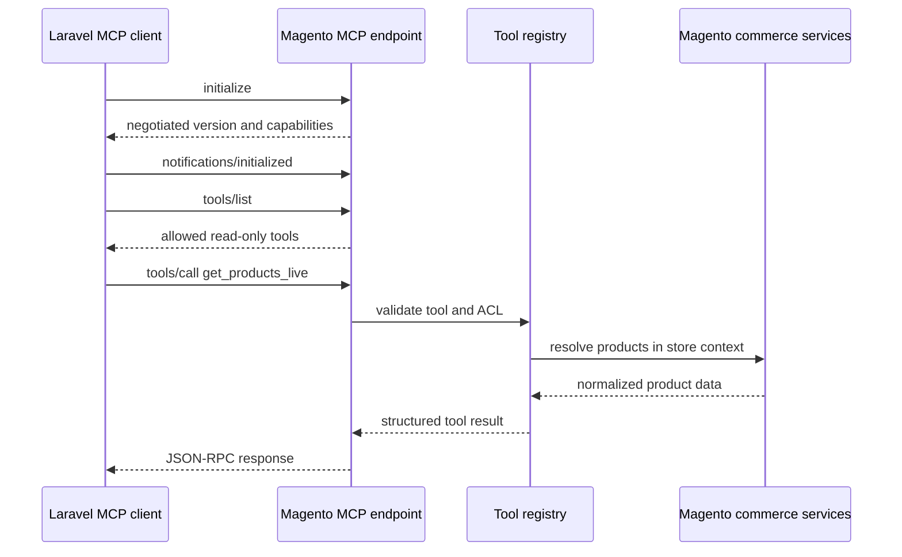

# Magento MCP Server Implementation Plan

## 1. Purpose

Build a Magento-native, authenticated, read-only MCP server that returns normalized
live commerce data to Laravel or another approved MCP client.

The module is not a general Magento administration agent. Its purpose is safe
customer-facing access to:

- Live products, pricing, salability, images, variants, and related products.
- Publicly available active promotions.
- A customer's own order status after Magento-issued identity verification.

---

## 2. Recommended Baseline

Read and compare both public Magento MCP implementations before building:

- [Freento/Magento-2-Mcp](https://github.com/Freento/Magento-2-Mcp)
- [boldcommerce/magento2-mcp](https://github.com/boldcommerce/magento2-mcp)

Use `Freento/Magento-2-Mcp` as the primary design and code reference for:

- Magento module registration.
- JSON-RPC routing.
- Tool registry.
- Bearer-token validation.
- Tool ACL roles.
- Admin configuration patterns.

Do not copy or retain its complete tool registry. Specifically do not register
general-purpose access to:

- Orders and order items outside the restricted `get_order_status` tool.
- Quotes and quote items.
- Customers.
- Credit memos.
- Administrators and locked administrators.
- Product cost.
- Generic entity analytics.
- Raw coupon collections, serialized rule conditions, or unrestricted cart rules.

Use `boldcommerce/magento2-mcp` as a secondary reference for product, stock,
related-product, order, and Magento REST concepts. Do not use it as the deployment
base because its stdio process, broad tool set, write tool, customer-data access,
and disabled TLS verification do not match this architecture.

Before reusing code from either repository:

- Confirm its license.
- Review current code, not only the README.
- Copy only narrowly required concepts.
- Rewrite tool outputs to match this project's normalized contracts.
- Add tests for every reused behavior.

---

## 3. Repository and Module Identity

This Magento installation already uses the vendor module:

```text
Lmarcho_RagSync
```

Create the MCP server as a separate module under the same vendor:

```text
Lmarcho_CommerceMcp
```

Recommended local development path:

```text
app/code/Lmarcho/CommerceMcp
```

Recommended Composer package name if the module is distributed through Composer:

```text
lmarcho/module-commerce-mcp
```

`Lmarcho_CommerceMcp` must remain separate from `Lmarcho_RagSync` because they
have different responsibilities:

- `Lmarcho_RagSync` pushes stable catalog/content changes to Laravel.
- `Lmarcho_CommerceMcp` serves authenticated live commerce reads.

The MCP module may integrate with shared vendor-level helpers where useful, but it
must not require `Lmarcho_RagSync` unless a concrete shared dependency is approved.
It should be independently enabled, disabled, versioned, and tested.

---

## 4. Proposed Module Structure

```text
Api/
  AuthenticationServiceInterface.php
  CustomerAssertionServiceInterface.php
  OrderStatusServiceInterface.php
  ProductHydratorInterface.php
  PromotionServiceInterface.php
  StoreContextResolverInterface.php
  ToolInterface.php
  ToolResultInterface.php
Api/Data/
  CommerceProductInterface.php
  OrderStatusInterface.php
  PromotionInterface.php
  StoreContextInterface.php
Controller/Mcp/
  Index.php
Controller/Customer/
  Assertion.php
Exception/
  AccessDeniedException.php
  AuthenticationException.php
  ContractException.php
  ToolExecutionException.php
Model/
  Authentication/
    AccessToken.php
    AccessTokenRepository.php
    CustomerAssertion.php
    CustomerAssertionService.php
    TokenGenerator.php
  Contract/
    ErrorFactory.php
    OrderStatusSerializer.php
    ProductSerializer.php
    PromotionSerializer.php
    ToolResult.php
  Mcp/
    JsonRpcParser.php
    ProtocolNegotiator.php
    RequestContext.php
    ResponseBuilder.php
    Server.php
    ToolRegistry.php
  Product/
    AttributeResolver.php
    AvailabilityResolver.php
    MediaResolver.php
    PriceResolver.php
    ProductHydrator.php
    ProductUrlResolver.php
    RelatedProductResolver.php
    VariantResolver.php
  Order/
    OrderAccessValidator.php
    OrderStatusService.php
  Promotion/
    PromotionEligibilityResolver.php
    PromotionService.php
  Store/
    StoreContextResolver.php
  Tool/
    GetActivePromotions.php
    GetOrderStatus.php
    GetProductsLive.php
    GetProductVariants.php
    GetRelatedProducts.php
    GetStoreContext.php
    SearchProductsLive.php
Service/
  AclValidator.php
  CorrelationId.php
  RateLimiter.php
Test/
  Integration/
  Unit/
etc/
  acl.xml
  adminhtml/
  config.xml
  db_schema.xml
  di.xml
  frontend/
  module.xml
registration.php
composer.json
```

Exact directories can follow the selected Magento version's conventions, but
responsibilities must remain separated.

---

## 5. Transport and Protocol

### Requirements

- One HTTPS MCP endpoint, for example `/commerce-mcp`.
- JSON-RPC 2.0 requests.
- MCP `initialize`, initialized notification, `ping`, `tools/list`, and
  `tools/call`.
- Streamable HTTP behavior compatible with the protocol version selected during
  prerequisites.
- Protocol version negotiation from an allow-list.
- JSON response support for normal tool calls.
- `structuredContent` in tool results.
- Correct content types and status handling.
- Request and response size limits.
- Correlation ID returned in response metadata and logs.

### Compatibility

Do not copy Freento's hardcoded protocol version without review.

At implementation start:

1. Record the latest stable MCP protocol revision.
2. Record Laravel client's supported revisions.
3. Support the agreed primary revision.
4. Optionally support one older tested revision during migration.
5. Reject unsupported revisions with a clear protocol error.

### Request lifecycle



---

## 6. Authentication and Authorization

## 6.1 Development stage

Allow a manually generated bearer token:

- Token shown once in Magento admin.
- Token stored hashed in Magento.
- Token stored using Laravel encrypted casts.
- Token belongs to one named MCP client.
- Client belongs to one tool role.
- Token can be revoked and rotated.
- Token has created, last-used, and optional expiry timestamps.

## 6.2 Pre-production stage

Before production readiness, add or verify:

- OAuth authorization metadata where required by selected MCP transport guidance.
- Confidential-client flow suitable for server-to-server integration.
- Short-lived access tokens or a documented rotation policy.
- Token audience/resource validation.
- Revocation.
- Failed-authentication rate limiting.

## 6.3 Roles

Create a role named `Lmarcho Chat Read Only` with only:

```text
get_store_context
get_products_live
search_products_live
get_product_variants
get_related_products
get_active_promotions
get_order_status
```

No role should default to "all tools."

Tool ACL and customer authorization are separate:

- The MCP client token authorizes Laravel to call `get_order_status`.
- A Magento-issued customer assertion proves which customer/order the current
  chat visitor may access.
- Both validations must pass.

---

## 7. Request Context

Every product tool requires a store code.

The server resolves:

- Store ID.
- Website ID and code.
- Currency.
- Locale.
- Secure base URL.
- Secure media base URL or CDN URL.
- Sales channel and stock ID.

Reject:

- Unknown store codes.
- Store codes outside the client's allowed list.
- Disabled stores.
- Arbitrary website or stock IDs supplied by the client.

Product and promotion requests are anonymous/public storefront requests.

`get_order_status` additionally requires a short-lived Magento-issued customer
assertion. Browser-provided customer IDs, email addresses, login flags, or order
numbers are not trusted identity.

---

## 8. Product Loading

Implement a `ProductHydrator` that:

1. Deduplicates and validates SKUs.
2. Enforces the batch limit.
3. Loads products in the requested store scope.
4. Excludes disabled or non-visible products for customer-facing tools.
5. Loads requested data sections only.
6. Produces one normalized product per SKU.
7. Records entity-specific partial errors.
8. Preserves candidate order where possible.

Avoid per-field repository calls. Profile database queries for configurable
products and eliminate obvious N+1 behavior.

Product attributes must use a server-side allow-list, initially:

- Manufacturer/brand.
- Material.
- Weight.
- Dimensions.
- Color option labels.
- Size option labels.
- Other tenant-approved customer-facing attributes.

Never expose:

- Cost.
- Internal notes.
- Supplier data.
- Source-level inventory.
- Backend-only attributes.

---

## 9. Product Media and URLs

## 9.1 Primary image

Resolve the primary image for the selected store view:

- Respect store-view attribute overrides.
- Prefer the product's configured base image.
- Return `null` when Magento uses the no-selection sentinel.
- Build an absolute media URL using Magento store/media services.
- Do not disable TLS verification.
- Support CDN-backed media base URLs.

## 9.2 Gallery

For each media gallery entry:

- Exclude disabled entries.
- Return an absolute URL.
- Return store-view label.
- Return position.
- Deduplicate the primary image from the gallery if desired by the contract.
- Enforce a gallery limit.

## 9.3 Variant images

For child variants:

- Use the child image when assigned.
- Otherwise optionally fall back to the parent image.
- Mark fallback behavior in tests.

## 9.4 Product URL

Generate the storefront URL using Magento URL services in the requested store
scope. Do not manually concatenate `url_key + ".html"`.

Tests must cover:

- URL rewrites.
- Store-view URL suffixes.
- Secure base URLs.
- CDN media.
- Missing images.
- Disabled gallery images.

---

## 10. Pricing

The MVP returns public pricing for the selected store context.

Required output:

- Currency.
- Regular price.
- Effective final price.
- Minimum and maximum price for ranged products.
- Discount amount and percentage when calculable.
- Tax-inclusion metadata.

Rules:

- Respect website/store price scope.
- Respect active special-price date windows.
- Use current Magento pricing services/indexes.
- Do not read raw product price and assume it is final.
- Do not expose cost.
- Do not accept an untrusted customer-group ID.
- Return `null` plus `PRICE_UNAVAILABLE` when price cannot be determined.

Configurable products must return a range when child final prices differ.

Tests must cover:

- Regular price.
- Current sale.
- Future sale.
- Expired sale.
- Configurable price range.
- Multi-website pricing.
- Missing price.

---

## 11. Inventory and Salability

Use Magento's inventory sales APIs for the selected sales channel.

Required output:

- `is_salable`.
- `IN_STOCK`, `OUT_OF_STOCK`, or `UNKNOWN`.
- Optional salable quantity based on policy.
- Backorder allowance if safe and relevant.
- Low-stock boolean only when based on an approved rule.

Do not use only `cataloginventory_stock_item.qty` as the customer-facing answer
when MSI is active.

The resolver must:

1. Map store to website/sales channel.
2. Resolve stock ID.
3. Query salability for requested SKUs in a batch where APIs allow.
4. Treat service failures as `UNKNOWN`.
5. Keep source-level quantities private.

Tests must cover:

- Salable product.
- Physical quantity present but not salable.
- Reservation effects.
- Backorders.
- Different sales-channel stock.
- Inventory service failure.

---

## 12. Variants

For configurable products:

- Return configurable option code, label, value, and value label.
- Return child SKU and child product name.
- Return child public price.
- Return child salability.
- Return child primary image with fallback rules.
- Exclude disabled children.
- Enforce requested and server maximum limits.

For simple products, `variants` is an empty array.

Bundle and grouped products may initially return summary pricing and empty
variants with a capability note. They should not be represented as configurable
products unless fully implemented and tested.

---

## 13. Related Products

Support Magento product links:

- Related.
- Upsell.
- Cross-sell.

Rules:

- Return only active, visible products.
- Preserve Magento link position where available.
- Hydrate only the fields requested by the tool.
- Enforce a strict limit.
- Avoid recursively returning related products of related products.

---

## 14. Active Promotions

Implement:

```text
get_active_promotions
```

Purpose:

- Answer general questions such as "What promotions are active?"
- Return public promotion summaries for the selected store context.
- Optionally identify promotions relevant to supplied product SKUs.

Input:

```json
{
  "store_code": "default",
  "skus": [
    "MCP-SIMPLE-001"
  ],
  "promotion_types": [
    "catalog",
    "cart"
  ],
  "limit": 20
}
```

Normalized output:

```json
{
  "schema_version": "1.0",
  "promotions": [
    {
      "external_id": "42",
      "type": "catalog",
      "name": "Summer Backpack Sale",
      "public_label": "Save 15% on selected backpacks",
      "description": "Discount is reflected in the displayed product price.",
      "starts_at": "2026-06-01T00:00:00Z",
      "ends_at": "2026-06-30T23:59:59Z",
      "coupon_required": false,
      "coupon_code": null,
      "applicable_skus": [
        "MCP-SIMPLE-001"
      ],
      "eligibility": "POTENTIALLY_ELIGIBLE"
    }
  ],
  "fetched_at": "2026-06-08T10:00:00Z"
}
```

Rules:

- Respect website, store, customer-group-public-context, active dates, and rule
  status.
- Catalog rule discounts already reflected in product final prices must not be
  added a second time.
- Cart rules are reported as potentially eligible until a real cart is evaluated.
- Do not expose serialized Magento rule conditions.
- Do not expose private, auto-generated, customer-specific, or single-use coupons.
- Expose a coupon code only when an administrator explicitly marks it public for
  chatbot display.
- Add module-owned public label, public description, and chatbot visibility fields
  if Magento's native rule data is insufficient.
- Return UTC timestamps and the store timezone.
- Enforce result and response-size limits.

Tests must cover:

- Active catalog rule.
- Active no-coupon cart rule.
- Public coupon rule.
- Private coupon rule excluded or code hidden.
- Future and expired rules excluded.
- Store/website-scoped rules.
- Product-specific rule relevance.
- Catalog discount not double-counted.
- Rules with complex conditions represented as potentially eligible.

---

## 15. Secure Order Status

Implement:

```text
get_order_status
```

Purpose:

- Allow a logged-in Magento customer to check only their own order status.
- Return a bounded customer-facing shipment/status summary.

This is not a generic `get_orders` or order-search tool.

Input:

```json
{
  "store_code": "default",
  "order_number": "000000123",
  "customer_assertion": "signed-short-lived-token"
}
```

Normalized output:

```json
{
  "schema_version": "1.0",
  "order": {
    "order_number": "000000123",
    "status": "processing",
    "status_label": "Processing",
    "placed_at": "2026-06-07T09:30:00Z",
    "currency": "USD",
    "grand_total": 89,
    "items": [
      {
        "sku": "MCP-SIMPLE-001",
        "name": "Voyager Backpack",
        "quantity": 1
      }
    ],
    "shipments": [
      {
        "carrier": "UPS",
        "tracking_number": "1Z999...",
        "tracking_url": "https://approved-carrier.example/track/1Z999..."
      }
    ]
  },
  "fetched_at": "2026-06-08T10:00:00Z"
}
```

### Customer assertion

`Lmarcho_CommerceMcp` must provide a same-origin Magento customer endpoint that
creates a short-lived signed assertion from the active Magento customer session.

Recommended claims:

- Issuer.
- Audience restricted to `Lmarcho_CommerceMcp`.
- Customer ID.
- Website/store scope.
- Issued-at and expiry.
- Random nonce.
- Optional order number scope.
- Session or token version for revocation.

Recommended lifetime: 2 to 5 minutes.

The assertion endpoint must:

- Require an authenticated Magento customer session.
- Use Magento form-key/CSRF protections as appropriate.
- Never accept a customer ID from request input.
- Return no order data.
- Be rate limited.

### Order authorization

For every `get_order_status` call:

1. Validate the MCP client token and tool ACL.
2. Validate assertion signature, issuer, audience, expiry, nonce, and store scope.
3. Load the order by increment/order number in the allowed website/store scope.
4. Verify the order's customer ID equals the assertion customer ID.
5. Return a generic `ORDER_NOT_ACCESSIBLE` response for missing and unauthorized
   orders to avoid order-number enumeration.
6. Log the correlation ID and a one-way hash of the order number, not full PII.

### Returned order fields

Allow:

- Order number.
- Customer-facing status and label.
- Placed date.
- Currency and grand total.
- Purchased item name, SKU, and quantity.
- Shipment carrier, tracking number, and validated tracking URL.

Do not return:

- Customer email or telephone.
- Billing or shipping addresses.
- Payment tokens or payment details.
- Internal comments or status history marked non-customer-visible.
- Fraud/risk information.
- Admin user details.
- Invoices, credit memos, or raw order payloads.

### Guest orders

Guest order lookup is excluded from the first implementation. Order number plus
email/postcode is not sufficient for this MCP design.

Add guest lookup later only with a verified OTP or a Magento-issued order-scoped
assertion.

Tests must cover:

- Customer can read their own order.
- Customer cannot read another customer's order.
- Expired, invalid, wrong-audience, and wrong-store assertions.
- Missing and unauthorized orders return indistinguishable public errors.
- Disabled customer/session revocation behavior.
- Shipment without tracking.
- Tracking URL allow-listing.
- No address, email, phone, payment, or internal comments in output.
- Rate limiting and order-number enumeration resistance.

---

## 16. Tool Implementation Order

### Phase M1: Skeleton

- Module registration.
- Configuration.
- Endpoint.
- JSON-RPC parser.
- Protocol negotiation.
- `initialize`, `ping`, and `tools/list`.
- Authentication and ACL.

### Phase M2: Store context

- Store resolver.
- Allowed store codes.
- Secure base/media URLs.
- `get_store_context`.

### Phase M3: Simple product hydration

- Product loader.
- URL.
- Media.
- Public price.
- Salability.
- `get_products_live`.

### Phase M4: Configurables

- Options.
- Child variants.
- Variant price/availability/media.
- Limits.

### Phase M5: Search and relations

- Candidate-SKU filtering.
- Native fallback search.
- Related product links.

### Phase M6: Promotions

- Promotion visibility fields/configuration.
- Catalog and cart rule readers.
- Public coupon policy.
- Product relevance.
- `get_active_promotions`.

### Phase M7: Customer assertion and order status

- Same-origin customer assertion endpoint.
- Assertion signing, expiry, nonce, and revocation.
- Order ownership validator.
- Customer-facing order serializer.
- Shipment/tracking serializer.
- `get_order_status`.

### Phase M8: Hardening

- Rate limiting.
- Response-size enforcement.
- Query profiling.
- Correlation logging.
- Token rotation and revocation.
- Assertion signing-key rotation.
- Order lookup abuse monitoring.
- Contract fixture verification.

---

## 17. Admin Configuration

Magento admin should provide:

- Module enabled.
- Allowed store codes.
- Exact quantity exposure enabled/disabled.
- Maximum SKUs per request.
- Maximum variants per product.
- Attribute allow-list.
- Promotion chatbot visibility and public labels.
- Public coupon exposure policy.
- Request rate limit.
- Separate order-status rate limit.
- MCP clients.
- Client token rotation/revocation.
- Client role.
- Customer assertion lifetime.
- Assertion signing-key rotation status.
- Last-used timestamp.
- Recent authentication failures.

Secrets must not be displayed after initial generation.

---

## 18. Logging and Observability

Log:

- Correlation ID.
- MCP client ID.
- Tool name.
- Store code.
- SKU count, not the entire payload.
- Duration by product, price, inventory, media, promotion, and order stages.
- Partial-error counts.
- Response size.
- Authentication and access-denied events.

Do not log:

- Plain access tokens.
- Full authorization headers.
- Customer data, raw customer assertions, and full order numbers.
- Unbounded product payloads.

Recommended metrics:

- Calls by tool.
- p50/p95 duration.
- Authentication failures.
- Rate-limited calls.
- Product partial-error rate.
- Price unavailable rate.
- Inventory unknown rate.
- Average SKU and variant count.
- Promotion result count.
- Order-status success, inaccessible, expired-assertion, and rate-limit counts.

---

## 19. Testing Plan

## 19.1 Unit tests

- JSON-RPC parsing and response IDs.
- Protocol negotiation.
- Tool input validation.
- ACL allow and deny behavior.
- Product serializer.
- Error serializer.
- Price discount calculation.
- Media URL normalization.
- Batch and variant limit enforcement.
- Promotion visibility and coupon-code policy.
- Customer assertion signature, expiry, audience, nonce, and store scope.
- Order ownership enforcement.
- Order serializer field allow-list.

## 19.2 Magento integration tests

- Store-view product overrides.
- Public final price.
- Special-price dates.
- MSI salability.
- Configurable children.
- Product URLs and media gallery.
- Disabled products and media.
- Related product links.
- Active promotion scope and visibility.
- Customer assertion issuance from a logged-in customer session.
- Own-order access and cross-customer denial.
- Customer-visible shipment/tracking data.
- Partial missing SKU.
- Cross-store isolation.

## 19.3 Protocol contract tests

Use raw HTTP requests to test:

1. Missing token.
2. Invalid token.
3. `initialize`.
4. `tools/list`.
5. Forbidden tool.
6. Valid `get_store_context`.
7. Valid `get_products_live`.
8. Partial error.
9. Invalid arguments.
10. Unsupported schema version.
11. Valid `get_active_promotions`.
12. Promotion private coupon exclusion.
13. `get_order_status` without customer assertion denied.
14. Valid own-order status.
15. Cross-customer order status denied.

## 19.4 Performance tests

Measure:

- 1, 5, 10, and 20 simple SKUs.
- Configurable product with 5, 12, and 50 children.
- Warm and cold Magento cache.
- Warm and cold Laravel cache.
- Media on local storage and CDN if available.
- Promotion rule sets with different scopes.
- Repeated authorized and unauthorized order-status requests.

---

## 20. Installation Workflow

The completed module should support:

```bash
composer require lmarcho/module-commerce-mcp
php bin/magento module:enable Lmarcho_CommerceMcp
php bin/magento setup:upgrade
php bin/magento cache:clean
```

For local `app/code` development, install the module at:

```text
app/code/Lmarcho/CommerceMcp
```

For production mode, the module guide must also include compilation and static
content deployment steps appropriate to the Magento version.

Provide CLI commands for:

- Creating a client.
- Creating/assigning the read-only role.
- Rotating a token.
- Revoking a token.
- Listing enabled tools.
- Running a local health check.
- Rotating the customer assertion signing key.
- Testing assertion issuance for a logged-in test customer.

---

## 21. Magento Completion Gate

Magento work is complete when:

- [ ] The module is named `Lmarcho_CommerceMcp` under the existing `Lmarcho`
  vendor.
- [ ] Both public MCP repositories were reviewed and are linked in implementation
  notes.
- [ ] Only the seven approved tools are registered.
- [ ] Initialization and tool discovery pass contract tests.
- [ ] Tokens can be created, rotated, and revoked.
- [ ] Store allow-listing is enforced.
- [ ] Simple products return URL, primary image, gallery, price, and salability.
- [ ] Configurable variants return bounded child data.
- [ ] MSI salability tests pass.
- [ ] Disabled products and images are excluded.
- [ ] Missing SKUs produce partial errors.
- [ ] Active public promotions are store-scoped and private coupon codes are not
  exposed.
- [ ] Order status requires a valid Magento-issued customer assertion.
- [ ] A customer can read only their own orders.
- [ ] Guest order lookup is unavailable without a future OTP/order-scoped proof.
- [ ] Order responses exclude addresses, contact details, payment data, and
  internal comments.
- [ ] Structured content matches shared fixtures.
- [ ] Performance targets are measured and documented.
- [ ] No sensitive entity tools are accessible.
